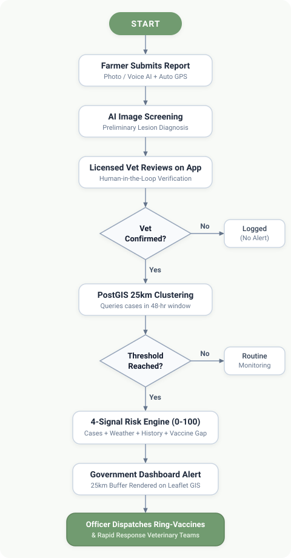
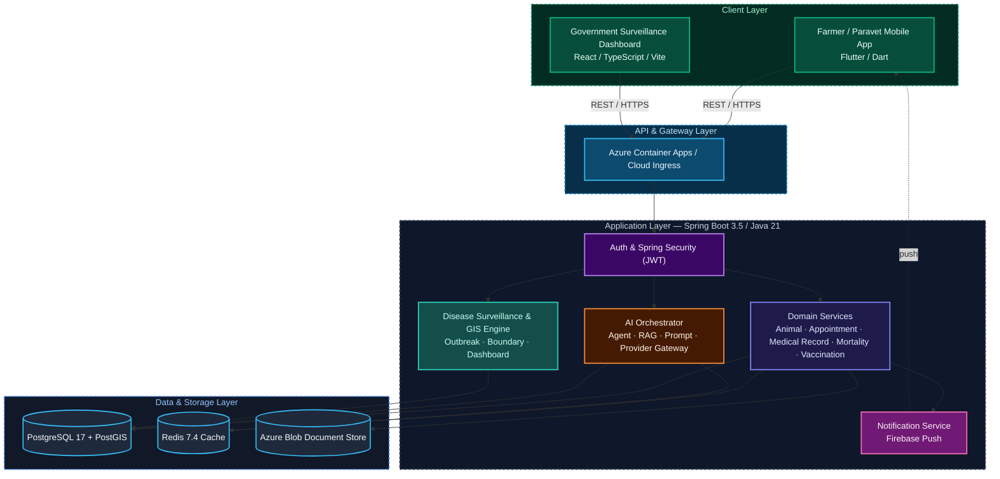

<div align="center">


# PASHU SATHI 

**National Animal Healthcare, Veterinary Telemedicine & Epidemiological Surveillance Platform**

Built for **Smart India Hackathon 2026** — Problem Statement **#26128**, Maharashtra State Innovation Society, MedTech Track

[](frontend/)
[](backend/)
[](backend/)
[](government-dashboard/)
[](government-dashboard/)
[](backend/)
[](backend/)
[](backend/)
[](#verification--test-coverage-summary)

</div>

---

## Table of Contents

- [Problem Statement](#problem-statement)
- [Overview](#overview)
- [Key Features](#key-features)
- [Outbreak Detection Flow](#outbreak-detection-flow)
- [System Architecture](#system-architecture)
- [Tech Stack](#tech-stack)
- [Repository Structure](#repository-structure)
- [Quick Start Guides](#quick-start-guides)
- [Verification & Test Coverage Summary](#verification--test-coverage-summary)
- [Localization](#localization)
- [Architectural & History Integrity Notice](#architectural--history-integrity-notice)

---

## Problem Statement

> **SIH Problem Statement #26128 — Livestock Disease Early Detection**
> Maharashtra State Innovation Society · MedTech Track · Smart India Hackathon 2025

Rural India loses an estimated **₹25,000 crore a year** to preventable livestock disease (DAHD), and outbreaks are typically confirmed **7–14 days** after the first animal falls sick — by then the herd is already dying. Maharashtra alone carries roughly **3.5 crore cattle**, and there is no unified way for a farmer, a field vet, and a district health officer to see the same outbreak at the same time.

**Pashu Sathi closes that loop end to end:** a farmer files a report from the field in seconds, an AI model does the first-pass screening, a licensed vet confirms it, and a spatial clustering + risk engine decides in real time whether it's an isolated case or the start of an outbreak — surfacing it on a government dashboard before it spreads.

---

## Overview

The platform ships as three coordinated applications sharing one backend:

1. **Multilingual Farmer & Paravet Mobile App** *(Flutter)* — AI-assisted symptom screening, emergency triage, digital animal health passports, offline-first sync, and veterinary appointment scheduling with in-app chat.
2. **Spring Boot Cloud Backend** — enterprise-grade REST APIs, JWT-based authentication, an agentic AI/RAG diagnosis pipeline, Redis caching, Azure Blob storage, and PostgreSQL + PostGIS spatial data.
3. **National Epidemiological & Government Command Dashboard** *(React)* — real-time GIS outbreak mapping, outbreak cluster intelligence, laboratory telemetry, automated vaccination campaigns, and administrative field reporting.

---

## Key Features

<table>
<tr>
<th>Farmer / Paravet App</th>
<th>Backend Platform</th>
<th>Government Dashboard</th>
</tr>
<tr valign="top">
<td>

- AI photo-based symptom scanner
- Conversational AI health advisor
- Digital animal health passports
- Vet appointment booking + in-app chat
- Vaccination & mortality logging
- Offline-first local sync
- Push notifications (Firebase)
- 4 languages: English, Hindi, Marathi, Urdu

</td>
<td>

- JWT authentication & user management
- Agentic AI diagnosis pipeline (RAG-backed)
- Disease outbreak reporting & clustering
- Vaccination campaign orchestration
- Mortality & medical record tracking
- Redis-cached, rate-limited REST APIs
- Firebase push + notification preferences
- Developer analytics & health endpoints

</td>
<td>

- Live GIS outbreak & cluster mapping
- Epidemiological analytics dashboard
- Laboratory surveillance telemetry
- Field surveillance report ledger
- Alerts management console
- Vaccination intelligence views
- Administrative boundary drill-down
- Protocols & reference library

</td>
</tr>
</table>

---

## Outbreak Detection Flow

The core of the platform: what happens between a farmer noticing something wrong and a district officer dispatching a response team.

<div align="center">

</div>

A single confirmed case doesn't trigger an alert on its own — the risk engine only escalates once a spatial and epidemiological pattern emerges, which is what keeps false alarms down and officer trust up.

---

## System Architecture



---

## Tech Stack

| Layer | Technologies |
| :--- | :--- |
| **Mobile App** | Flutter 3.x, Dart, Riverpod, go_router, Dio, flutter_secure_storage, camera, speech_to_text |
| **Backend** | Spring Boot 3.5.16, Java 21, Spring Security (JWT), Spring Data JPA, Flyway, Resilience4j |
| **AI Pipeline** | Custom orchestrator, agent & RAG packages, pluggable model provider gateway |
| **Dashboard** | React 18, TypeScript 5.7, Vite 6, TanStack Query, Leaflet (GIS), Tailwind CSS |
| **Data** | PostgreSQL 17 + PostGIS, Redis 7.4 |
| **Storage & Messaging** | Azure Blob / S3-compatible storage, Firebase Cloud Messaging |
| **Infra** | Docker Compose (local), Azure Container Apps (cloud) |

---

## Repository Structure

```
pashu-sathi/
├── frontend/                   # Cross-Platform Flutter Mobile Application
│   ├── lib/                    # Application source (core/ + features/, MVVM-style)
│   ├── assets/                 # Icons, branding, illustrations & offline bundles
│   ├── test/                   # Flutter unit & widget test suite (157 tests)
│   └── pubspec.yaml            # Flutter package dependencies
│
├── backend/                    # Spring Boot 3.5.16 Cloud Enterprise Backend
│   ├── src/main/java/app/vetra # Domain modules: auth, animal, appointment, ai, disease,
│   │                           # vaccination, mortality, medicalrecord, notification, dashboard...
│   ├── src/main/resources/     # Flyway migrations, application profiles
│   ├── src/test/java/app/vetra # Backend unit & integration test suites (464 tests)
│   ├── docker-compose.yml      # Local Postgres/PostGIS + Redis stack
│   ├── pom.xml                 # Maven build configuration
│   └── Dockerfile              # Multi-stage production container build
│
├── government-dashboard/       # National Epidemiological Surveillance Web Application
│   ├── src/pages/               # Command overview, outbreak intel, GIS map, alerts, labs...
│   ├── src/components/          # Reusable React UI components
│   ├── src/test/                # Vitest suite for UI & GIS logic (95 tests)
│   └── package.json             # Node.js dependencies and build scripts
│
├── docs/                       # Technical documentation, specifications & case studies
│   ├── architecture/           # Full system architecture audits & reports
│   ├── design/                 # UI/UX design specifications & tokens
│   └── sih/                    # SIH problem statement case studies & SWOT analyses
│
└── README.md                   # Monorepo documentation & quick-start guide
```

---

## Quick Start Guides

### 1. Frontend (Flutter Mobile App)

```bash
cd frontend

# Get Flutter dependencies
flutter pub get

# Run static analysis (0 warnings)
flutter analyze

# Run test suite (157 tests)
flutter test

# Run app on connected device or simulator
flutter run
```

### 2. Backend (Spring Boot 3.5.16)

```bash
cd backend

# Build and verify checkstyle
./mvnw checkstyle:check

# Run unit tests
./mvnw test

# Start the Spring Boot application locally
./mvnw spring-boot:run
```

*Default local API endpoint:* `http://localhost:8080/api`
*Default Swagger/OpenAPI documentation:* `http://localhost:8080/swagger-ui.html`

### 3. Government Surveillance Dashboard (React / Vite)

```bash
cd government-dashboard

# Install dependencies
npm install

# Run TypeScript type check
npm run lint

# Run Vitest test suite (95 tests)
npm test

# Launch local development server
npm run dev
```

*Default development URL:* `http://localhost:3000`

---

## Verification & Test Coverage Summary

| Subsystem | Technology | Test Runner | Test Count | Status |
| :--- | :--- | :--- | :--- | :--- |
| **Frontend** | Flutter / Dart | `flutter test` | 157 passed | Passing |
| **Backend** | Spring Boot / JUnit 5 | `./mvnw test` | 464 passed | Passing |
| **Government Dashboard** | React / Vitest | `vitest run` | 95 passed | Passing |
| **Total** | | | **716 passed** | Passing |

---

## Localization

The mobile app ships fully localized in four languages, so farmers and paravets can use it in the language they're most comfortable with:

**English · हिंदी (Hindi) · मराठी (Marathi) · اردو (Urdu)**

---

## Architectural & History Integrity Notice

- **Full Git History Preserved**: The repository merges all historical commits from the independent Flutter frontend, Spring Boot backend, and Government Dashboard repositories via standard `git subtree` without squashing, rewriting, or rebasing.
- **Package Integrity**: All backend Java packages (`app.vetra.*`), database migration sequences, and API contracts remain strictly preserved to ensure seamless zero-downtime deployment.
