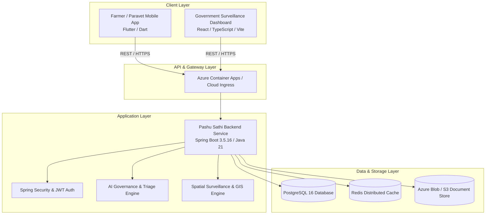

# PASHU SATHI (पशु साथी)

> **National Animal Healthcare, Veterinary Telemedicine & Epidemiological Surveillance Platform**  
> *Developed for Smart India Hackathon (SIH)*

[](frontend/)
[](backend/)
[](government-dashboard/)
[](government-dashboard/)
[](backend/)
[](backend/)

---

## 📌 Overview

**PASHU SATHI** is a unified, end-to-end veterinary and livestock intelligence platform engineered to bridge the gap between rural farmers, certified veterinarians, para-vets, and national disease surveillance authorities.

The platform provides:
1. **Multilingual Farmer & Paravet Mobile App**: AI-assisted symptom screening, emergency triage, digital animal health passports, offline-first sync, and veterinary appointment scheduling.
2. **Spring Boot Cloud Backend**: Enterprise-grade REST APIs, JWT & biometric authentication, Redis caching, MinIO/Azure Blob storage, and PostgreSQL relational data models.
3. **National Epidemiological & Government Command Dashboard**: Real-time GIS outbreak mapping, outbreak cluster intelligence, laboratory telemetry, automated vaccination campaigns, and administrative field reporting.

---

## 🏛️ System Architecture



---

## 📂 Repository Structure

```
pashu-sathi/
├── frontend/                   # Cross-Platform Flutter Mobile Application
│   ├── lib/                    # Application source code (MVVM / Clean Architecture)
│   ├── assets/                 # Icons, branding, illustrations & offline bundles
│   ├── test/                   # Comprehensive Flutter unit & widget test suite (157+ tests)
│   └── pubspec.yaml            # Flutter package dependencies
│
├── backend/                    # Spring Boot 3.5.16 Cloud Enterprise Backend
│   ├── src/main/java/app/vetra # Application modules, services, controllers, entities
│   ├── src/main/resources/     # Database migrations (Flyway), application profiles
│   ├── src/test/java/app/vetra # Backend unit & integration test suites
│   ├── pom.xml                 # Maven build configuration
│   └── Dockerfile              # Multi-stage production container build
│
├── government-dashboard/       # National Epidemiological Surveillance Web Application
│   ├── src/                    # React 18 + TypeScript + Vite UI components
│   ├── src/test/               # Vitest suite for UI & GIS logic (95+ tests)
│   ├── public/                 # Static assets, branding & icons
│   └── package.json            # Node.js dependencies and build scripts
│
├── docs/                       # Technical documentation, specifications & case studies
│   ├── architecture/           # Full system architecture audits & reports
│   ├── design/                 # UI/UX design specifications & tokens
│   └── sih/                    # SIH problem statement case studies & SWOT analyses
│
└── README.md                   # Monorepo documentation & quick-start guide
```

---

## 🚀 Quick Start Guides

### 1. Frontend (Flutter Mobile App)

```bash
cd frontend

# Get Flutter dependencies
flutter pub get

# Run static analysis (0 warnings)
flutter analyze

# Run test suite (157 tests)
flutter test

# Run app on connected device or simulator
flutter run
```

### 2. Backend (Spring Boot 3.5.16)

```bash
cd backend

# Build and verify checkstyle
./mvnw checkstyle:check

# Run unit tests
./mvnw test

# Start the Spring Boot application locally
./mvnw spring-boot:run
```

*Default local API endpoint:* `http://localhost:8080/api`  
*Default Swagger/OpenAPI documentation:* `http://localhost:8080/swagger-ui.html`

### 3. Government Surveillance Dashboard (React / Vite)

```bash
cd government-dashboard

# Install dependencies
npm install

# Run TypeScript type check
npm run lint

# Run Vitest test suite (95 tests)
npm test

# Launch local development server
npm run dev
```

*Default development URL:* `http://localhost:3000`

---

## 🧪 Verification & Test Coverage Summary

| Subsystem | Technology | Test Runner | Test Count | Status |
| :--- | :--- | :--- | :--- | :--- |
| **Frontend** | Flutter / Dart | `flutter test` | 157 passed | ✅ All Green |
| **Backend** | Spring Boot / JUnit 5 | `./mvnw test` | 464 passed | ✅ All Green |
| **Government Dashboard** | React / Vitest | `vitest run` | 95 passed | ✅ All Green |

---

## 🔒 Architectural & History Integrity Notice

- **Full Git History Preserved**: The repository merges all historical commits from the independent Flutter frontend, Spring Boot backend, and Government Dashboard repositories via standard `git subtree` without squashing, rewriting, or rebasing.
- **Package Integrity**: All backend Java packages (`app.vetra.*`), database migration sequences, and API contracts remain strictly preserved to ensure seamless zero-downtime deployment.
